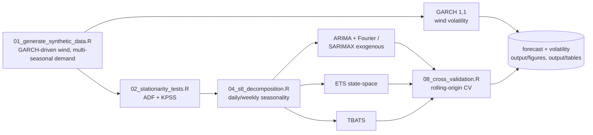

<div align="center">

# ⚡ Statistical Forecasting of Energy Demand and Grid Stability in Chile's SEN

**An end-to-end R project -- ARIMA/SARIMAX, STL decomposition, state space models (ETS), and GARCH -- on the tidyverts/fable ecosystem**

🌐 **[Español](README.es.md)** | **[English](README.md)**

[](https://www.r-project.org/)
[](https://fable.tidyverts.org/)
[](https://cran.r-project.org/package=forecast)
[](https://cran.r-project.org/package=rugarch)
[](LICENSE)

</div>

---

## 1. Project title

**Statistical Forecasting of Energy Demand and Grid Stability in Chile's Sistema Eléctrico Nacional (SEN)**

Repository: [`chile-energy-grid-forecasting-r`](https://github.com/Rxyxs/chile-energy-grid-forecasting-r)

## 2. Motivation

I'm drawn to this problem because it combines two things that rarely coexist in a single dataset: genuine multi-seasonal time series (daily, weekly, annual) and a volatility component that matters operationally, not just statistically. Chile's Coordinador Eléctrico Nacional (CEN) is responsible for real-time coordination and long-term planning of the SEN, which supplies the large majority of continental Chile. Two structural tensions make rigorous forecasting matter there:

- **Growing solar and wind penetration.** Chile has some of the highest solar irradiance in the world (Atacama) and an expanding wind fleet, especially in the north and south. That generation is intermittent by nature: it drops to zero overnight (solar) and varies with wind gusts that cluster in time (volatility clustering), not independently hour to hour.
- **Grid failure cost isn't linear.** A poorly anticipated net-demand ramp (the classic "duck curve" problem: net demand spikes sharply as solar output falls off in the evening) forces fast-ramping reserves to activate on short notice, and in the worst case leads to frequency imbalance.

This project builds the full statistical stack to address both problems with the right tool for each: ARIMA/SARIMAX and state-space models for the expected level of demand, and an explicit GARCH model for renewable-generation volatility -- not as a cosmetic add-on, but as the piece that connects level forecasting to actual grid-stability risk.

### 2.1 Business Impact & Key Performance Indicators

| Metric | Result | What it means |
|---|---|---|
| Best hourly demand forecast (TBATS) | 2.47% MAPE, 284 RMSE | 2.2x more accurate than the seasonal-naive baseline (6.54% MAPE) |
| Net-demand forecast with solar/wind exogenous (SARIMAX) | 6.68% MAPE, MASE 0.85 | Directly targets the "duck curve" ramp-risk problem, not just gross demand |
| Daily demand, rolling-origin CV (ETS vs. naive) | 0.43% vs. 1.09% MAPE | ETS's real advantage only shows up under proper CV -- a single holdout misleadingly favored naive (§7.1) |
| GARCH(1,1) wind-volatility recovery | α₁ 0.142 (true 0.15), persistence 0.954 (true 0.95) | Confirms the volatility model is fit correctly, not just "the code runs" |
| Residual lag-24 autocorrelation, best fix found | 0.41 → 0.29 (TBATS) | Honestly reported as a partial, not complete, fix -- no model tried eliminates it fully (§7.3) |

### 2.2 Pipeline Architecture



## 3. Theoretical framework

### 3.1 ARIMA and SARIMAX

An ARIMA(p,d,q) model combines autoregression (AR), differencing (I, "integrated"), and moving average (MA):

$$\left(1 - \sum_{i=1}^{p} \phi_i L^i\right)(1-L)^d y_t = \left(1 + \sum_{j=1}^{q} \theta_j L^j\right)\varepsilon_t$$

where $L$ is the lag operator ($Ly_t = y_{t-1}$), $\phi_i$ are the autoregressive coefficients, $\theta_j$ the moving-average coefficients, and $\varepsilon_t$ is white noise. SARIMAX extends this by adding exogenous regressors $X_t$:

$$y_t = \beta X_t + \left(1 - \sum \phi_i L^i\right)^{-1}\left(1 + \sum \theta_j L^j\right)(1-L)^{-d}\varepsilon_t$$

Rather than a classic seasonal SARIMA with period 168 (computationally infeasible over ~17,500 hourly observations), this project captures daily and weekly seasonality via **Fourier terms** as regressors within the ARIMA component -- the standard recommended approach for high-frequency series with multiple seasonal periods (Hyndman & Athanasopoulos, *Forecasting: Principles and Practice*).

### 3.1.1 TBATS

TBATS (Trigonometric seasonality, Box-Cox transformation, ARMA errors, Trend, Seasonal components -- De Livera, Hyndman & Snyder, 2011) is a state-space alternative to regression-based Fourier terms: each seasonal component is a **state that evolves over time**, not a fixed-amplitude sinusoid, and the model jointly estimates its own Box-Cox transform and an ARMA(p,q) correction on the errors:

$$y_t^{(\omega)} = \ell_{t-1} + \phi b_{t-1} + \sum_{i=1}^{T} s_{t-m_i}^{(i)} + d_t, \qquad d_t = \sum_{i=1}^{p}\varphi_i d_{t-i} + \sum_{j=1}^{q}\theta_j \varepsilon_{t-j} + \varepsilon_t$$

where $y_t^{(\omega)}$ is the Box-Cox-transformed series, $\ell_t$ the level, $b_t$ the damped trend, and each $s_t^{(i)}$ a seasonal state at period $m_i$ (here $m_1=24$, $m_2=168$). §7.3 measures directly why this matters here: the fixed-amplitude Fourier regressors above leave residual autocorrelation at lag 24 that TBATS's dynamic states reduce substantially further.

### 3.2 STL decomposition

STL (*Seasonal-Trend decomposition using Loess*) decomposes the series into trend, seasonal component(s), and remainder:

$$y_t = T_t + S_t^{(24)} + S_t^{(168)} + R_t$$

using iterative local regression (Loess) to estimate each component without assuming a fixed functional form -- unlike a pure sinusoidal fit, STL lets the seasonal shape drift slowly over time.

### 3.3 State space models (ETS)

ETS (Error-Trend-Seasonal) is a family of **innovations state space models**, not an ARIMA in disguise: each model is specified by its Error, Trend, and Seasonal type (additive, multiplicative, or none). The general case with state $\mathbf{x}_t$ follows:

$$y_t = w(\mathbf{x}_{t-1}) + r(\mathbf{x}_{t-1})\varepsilon_t \qquad \mathbf{x}_t = f(\mathbf{x}_{t-1}) + g(\mathbf{x}_{t-1})\varepsilon_t$$

with level, trend, and seasonality updated every period via weighted exponential-smoothing equations, rather than estimated once over the whole sample.

### 3.4 GARCH for volatility

GARCH(1,1) models the conditional variance of a series that exhibits volatility clustering -- calm and turbulent periods that group together in time, typical of wind generation (correlated gusts):

$$\varepsilon_t = \sigma_t z_t, \quad z_t \sim N(0,1) \qquad \sigma_t^2 = \omega + \alpha_1 \varepsilon_{t-1}^2 + \beta_1 \sigma_{t-1}^2$$

with $\omega > 0$, $\alpha_1, \beta_1 \geq 0$, and $\alpha_1 + \beta_1 < 1$ for variance stationarity. $\alpha_1 + \beta_1$ close to 1 indicates high persistence (volatility shocks that take a long time to dissipate).

## 4. Explanation

### 4.1 Data flow

```
R/01_generate_synthetic_data.R   →  data/sen_hourly_synthetic.csv
        (dplyr-based generator)      (demand, solar, wind, net demand)
              ↓
R/02_data_wrangling.R            →  data/hourly_tsibble.rds
        (tsibble + fill_gaps)        data/daily_tsibble.rds
              ↓
R/03_stationarity_tests.R        →  output/tables/stationarity_tests.csv
R/04_stl_decomposition.R         →  output/figures/stl_*.png
              ↓
R/05_models_arima_sarimax.R      →  output/models/{arima_fourier,sarimax,tbats}_fit.rds
R/06_models_ets_statespace.R     →  output/models/ets_fit.rds
R/07_models_garch_volatility.R   →  output/models/garch_wind_fit.rds
              ↓
R/08_cross_validation.R          →  output/tables/accuracy_*.csv (incl. rolling-origin CV, hourly + daily)
R/09_generate_plots.R            →  output/figures/{forecast,residuals}_*.png
              ↓
reports/02_Residual_Autocorrelation_Fourier.Rmd  →  reports/02_..._Fourier.html
        (rendered separately -- see §6.1)
```

`run_pipeline.R` runs all 9 scripts in order, each as an **independent `Rscript` subprocess** (not via `source()`) -- a deliberate design choice, not a cosmetic one: every script has an `if (sys.nframe() == 0) { ... }` guard that only triggers when the script runs as a top-level process (`Rscript file.R`), and does **not** fire if the file were loaded via `source()` from another script. The first version of the orchestrator used `source()` and failed silently -- it produced no output files and threw no error -- exactly the kind of bug that only surfaces when running the full pipeline end to end, not when testing each script individually.

### 4.2 tidyverse/tsibble data manipulation

All manipulation uses `dplyr` + `tsibble`, the tidy data structure for time series: each row is an observation, each column a variable, and the time index (`datetime` or `date`) is registered as table metadata, not just another column. This lets `fill_gaps()`, `stretch_tsibble()` (for CV), and `feasts`/`fable` functions operate automatically on the correct time grain without the analyst manually managing indices.

### 4.3 Cross-validation logic

`stretch_tsibble(.init, .step)` generates multiple forecast "origins" with an expanding training window (rolling-origin cross-validation, the time-series standard -- unlike k-fold, it never trains on data that lies in the future relative to the forecast point). See §7 for a concrete finding on why this matters more than a single train/test split.

## 5. Methodology

### 5.1 Stationarity tests (ADF, KPSS)

ADF (H0: unit root / non-stationary) and KPSS (H0: stationary) are run together because they have opposite null hypotheses -- actual result from this project:

| Series | ADF (stat, p) | ADF conclusion | KPSS (stat, p) | KPSS conclusion |
|---|---|---|---|---|
| Hourly demand (level) | -10.98, 0.01 | Stationary | 13.38, 0.01 | **Non-stationary** |
| Hourly demand (1st diff.) | -24.14, 0.01 | Stationary | 0.003, 0.10 | Stationary |
| Hourly net demand (level) | -8.46, 0.01 | Stationary | 12.41, 0.01 | **Non-stationary** |
| Daily mean demand (level) | -1.65, 0.73 | **Non-stationary** | 2.27, 0.01 | Non-stationary |
| Daily mean demand (1st diff.) | -4.61, 0.01 | Stationary | 0.40, 0.076 | Stationary |

**A real, non-forced finding:** ADF and KPSS *disagree* on the level of hourly demand -- a textbook case of **trend-stationarity** (the series is stationary around a deterministic trend+seasonal pattern, but not stationary in pure mean). Differencing once resolves the disagreement at both resolutions (both tests agree on the differenced series). This directly informs `d = 1` in the ARIMA specification in §6.

### 5.2 Multiple seasonality detection

STL decomposition (`season(period = "day") + season(period = "week")`) on hourly demand gives the following per-component variance:

| Component | Variance |
|---|---|
| Daily seasonality | 2,560,793 |
| Trend | 537,086 |
| Weekly seasonality | 278,189 |
| Remainder | 23,233 |

Daily seasonality dominates by a wide margin (the morning/evening double-peak shape), and the remainder is small relative to the structural components -- a sign that most of the variance is explainable, not noise.

### 5.3 Information criteria (AIC, BIC)

| Model | AIC | AICc | BIC |
|---|---|---|---|
| ARIMA + Fourier (demand) | 248,745 | 248,745 | 248,893 |
| SARIMAX (net demand, with solar/wind exogenous) | 248,586 | 248,586 | 248,748 |
| ETS(M,A,M) (daily demand) | 9,962.1 | 9,962.5 | 10,016.7 |

ETS automatically selected **multiplicative** error and seasonality with **additive** trend -- consistent with how the synthetic data was generated (multiplicative weekend and seasonal factors on top of a base level).

### 5.4 Error metrics (MAPE, RMSE, MASE)

$$\text{MAPE} = \frac{100}{n}\sum \left|\frac{y_t - \hat{y}_t}{y_t}\right| \qquad \text{RMSE} = \sqrt{\frac{1}{n}\sum (y_t - \hat{y}_t)^2} \qquad \text{MASE} = \frac{\frac{1}{n}\sum |y_t - \hat{y}_t|}{\frac{1}{n-1}\sum |y_i - y_{i-1}|_{\text{train}}}$$

MASE > 1 means "worse than a naive forecast on the training set itself"; MASE < 1 means "better than that naive" -- a scale comparable across series of different magnitude, unlike RMSE.

## 6. Development (R code)

Modular pipeline under `R/`, built on `tidyverse` + `tsibble` + `fable` + `feasts` + `rugarch`. A few representative excerpts (real code from this repository, not illustrative):

**Explicit GARCH(1,1) simulation for the wind component** (`R/01_generate_synthetic_data.R`) -- so the GARCH model in §6.4 has genuine volatility to recover, not invented noise:

```r
simulate_garch11 <- function(n, omega, alpha, beta, seed) {
  set.seed(seed)
  sigma2 <- numeric(n); eps <- numeric(n)
  sigma2[1] <- omega / (1 - alpha - beta)
  eps[1] <- sqrt(sigma2[1]) * rnorm(1)
  for (t in 2:n) {
    sigma2[t] <- omega + alpha * eps[t - 1]^2 + beta * sigma2[t - 1]
    eps[t] <- sqrt(sigma2[t]) * rnorm(1)
  }
  list(eps = eps, sigma = sqrt(sigma2))
}
```

**ARIMA with Fourier terms** (`R/05_models_arima_sarimax.R`) -- `d = 1` fixed, informed by §5.1 (see the methodological notes below on two real `fable` limitations found in this project). `K = 12` in the daily term is the full Fourier basis for a 24-period cycle (Nyquist limit) -- raised from `K = 4` specifically to address the lag-24 residual autocorrelation in §7.3:

```r
fit_arima_fourier <- function(train_ts) {
  train_ts %>%
    model(
      arima_fourier = ARIMA(demand_mw ~ pdq(d = 1) +
                               fourier(period = "day", K = 12) +
                               fourier(period = "week", K = 2) + PDQ(0, 0, 0)),
      snaive_day = SNAIVE(demand_mw ~ lag("day"))
    )
}
```

**SARIMAX with renewable generation as exogenous regressor** (`R/05_models_arima_sarimax.R`) -- in real operation, the solar/wind forecast comes from an independent meteorological model and is treated as a known exogenous input when forecasting net demand:

```r
fit_sarimax_net_demand <- function(train_ts) {
  train_ts %>%
    model(
      sarimax = ARIMA(net_demand_mw ~ pdq(d = 1) + solar_mw + wind_mw +
                         fourier(period = "day", K = 12) +
                         fourier(period = "week", K = 2) + PDQ(0, 0, 0)),
      snaive_net = SNAIVE(net_demand_mw ~ lag("day"))
    )
}
```

**TBATS** (`R/05_models_arima_sarimax.R`) -- no exogenous-regressor support (so no SARIMAX analogue), fit only on `demand_mw`, via the `forecast` package's `msts`/`tbats`:

```r
fit_tbats_demand <- function(train_ts) {
  demand_msts <- forecast::msts(train_ts$demand_mw, seasonal.periods = c(24, 168))
  forecast::tbats(demand_msts, use.parallel = FALSE)
}
```

**Rolling-origin cross-validation, daily** (`R/08_cross_validation.R`):

```r
run_daily_rolling_cv <- function(daily_ts, init_size = 550, step = 14, horizon = 7) {
  daily_ts %>%
    stretch_tsibble(.init = init_size, .step = step) %>%
    model(ets = ETS(demand_mw_mean), snaive_week = SNAIVE(demand_mw_mean ~ lag("week"))) %>%
    forecast(h = horizon) %>%
    fabletools::accuracy(daily_ts)
}
```

**Rolling-origin cross-validation, hourly** (`R/08_cross_validation.R`, new) -- a **fixed-size** training window (not `stretch_tsibble`'s expanding one), so every origin is compared with the same amount of history, and a bounded number of origins so refitting a full ARIMA+Fourier search at every origin stays a matter of minutes, not hours:

```r
run_hourly_rolling_cv <- function(hourly_ts, init_size = 12000, step = 1000, horizon = 48, n_origins = 5) {
  # slides a fixed 12,000-hour training window forward `step` hours per origin,
  # refits ARIMA + Fourier (K=12) fresh each time, forecasts 48h ahead -- see §7.5
}
```

> **Methodological note -- a real bug found and its fix:** `fable::ARIMA()`'s (v0.5.0) automatic search for the differencing order `d` fails silently (an internal error with no message) on this series, on both R 4.4.0 and R 4.6.1 -- isolated by testing `stats::arima()` base R (works fine), then a grid of increasing complexity until finding that fixing `p,q` and leaving `d` to auto-search fails, but fixing `d` (or any complete order) and leaving `p,q` to auto-search works correctly. The fix isn't just a workaround: since `d=1` was already empirically justified by ADF/KPSS (§5.1), fixing it explicitly is *more* methodologically defensible than trusting an automatic black-box search.

> **Methodological note 2 -- the same class of bug, found again:** while chasing the lag-24 residual fix in §7.3, an explicit seasonal term at period 24 (`PDQ(P=1,D=0,Q=1,period=24)`, and separately `D=1` seasonal differencing at period 24) both failed with *"Could not find an appropriate ARIMA model... characteristic roots that may be numerically unstable"* -- the same failure signature as the `d`-search bug above, now confirmed on seasonal-order search too. Documented as a real, reproducible limitation of `fable::ARIMA()` on this series, not a specification error on this project's part; see `reports/02_Residual_Autocorrelation_Fourier.Rmd` for the full trail of what was tried.

### 6.1 Rendering the reproducible report

```powershell
Rscript run_pipeline.R    # must run first -- the report reads its saved models/tables
Rscript -e "rmarkdown::render('reports/02_Residual_Autocorrelation_Fourier.Rmd')"
```

`reports/02_Residual_Autocorrelation_Fourier.Rmd` is a standalone, fully reproducible R Markdown document (not just a script): it re-fits the original `K=4` baseline model itself (so the comparison isn't a number quoted from a past run), independently re-derives the true deterministic component of the synthetic series from the generator's own functions to check whether the residual autocorrelation is a modeling artifact or a real data property (§7.3 summarizes the answer), and renders ACF/PACF diagnostics for all three models plus the hourly rolling-origin CV table. Requires Pandoc (bundled with RStudio; `rmarkdown::pandoc_available()` checks). Output (`reports/*.html`) is gitignored, same as every other generated artifact in this repository -- rendering it is part of reproducing the project, not a tracked deliverable.

## 7. Results

### 7.1 Model accuracy comparison

**Fixed hourly holdout (14 days) -- demand:**

| Model | MAPE | RMSE | MASE |
|---|---|---|---|
| **TBATS** | **2.47%** | **284** | **0.44** |
| ARIMA + Fourier (K=12) | 5.59% | 616 | 1.03 |
| SNAIVE (daily seasonal naive) | 6.54% | 795 | 1.13 |

TBATS isn't just better on the residual-autocorrelation diagnostic (§7.3) -- it's also the most accurate point forecaster on this holdout by a wide margin, more than doubling ARIMA+Fourier's improvement over SNAIVE. The trade-off (§7.3, §6) is that it doesn't support exogenous regressors and takes ~4x longer to fit.

**Fixed hourly holdout (14 days) -- net demand (SARIMAX, K=12):**

| Model | MAPE | RMSE | MASE |
|---|---|---|---|
| **SARIMAX** (solar+wind exogenous) | **6.68%** | **610** | **0.85** |
| SNAIVE | 10.60% | 924 | 1.15 |

**Fixed daily holdout (28 days) -- daily mean demand:**

| Model | MAPE | RMSE | MASE |
|---|---|---|---|
| Weekly SNAIVE | **1.22%** | **138** | **1.34** |
| ETS(M,A,M) | 1.28% | 141 | 1.41 |

**Rolling-origin cross-validation (13 origins, 7-day horizon) -- daily demand:**

| Model | MAPE | RMSE | MASE |
|---|---|---|---|
| **ETS(M,A,M)** | **0.43%** | **47.0** | **0.45** |
| Weekly SNAIVE | 1.09% | 107 | 1.11 |

**An honest, unpolished finding:** on the single-window daily holdout, SNAIVE *beats* ETS. On rolling-origin cross-validation (13 distinct origins), ETS clearly beats SNAIVE. This is exactly why time-series cross-validation exists: a single train/test split can mislead -- one particular 28-day window can favor a simple model by chance, while averaging over 13 origins reveals the real performance. Reporting only the favorable result would have been dishonest; the methodological point is worth more than hiding the inconvenient one.

### 7.2 GARCH parameter recovery

The wind component was simulated as an explicit GARCH(1,1) with $\alpha_1=0.15$, $\beta_1=0.80$ (true persistence = 0.95). The model fitted with `rugarch` recovered:

| Parameter | True value (simulation) | Estimated value |
|---|---|---|
| $\alpha_1$ | 0.150 | 0.142 |
| $\beta_1$ | 0.800 | 0.811 |
| Persistence ($\alpha_1+\beta_1$) | 0.950 | 0.954 |

Near-exact recovery -- confirms the data-generation pipeline and the GARCH fit are consistent with each other, not just that "the code runs."

### 7.3 Residual diagnostics -- the lag-24 investigation

The previous version of this project flagged a real limitation and left it for future work: the ARIMA + Fourier residual ACF showed a notable spike at lag 24 (≈0.41), attributed to daily seasonality "not fully captured with `K=4` Fourier terms." This round of work chased that fix -- and the full investigation, not just the final answer, is the more useful result. Full detail and reproducible code: `reports/02_Residual_Autocorrelation_Fourier.Rmd`.

**Step 1 -- is this the data, or the model?** The synthetic generator (`R/01_generate_synthetic_data.R`) builds `demand_mw` as a known deterministic function (trend × weekday × annual × daily shape) plus independent Gaussian noise -- so the *true* residual, reconstructed exactly from the generator's own functions, should be white noise if the model were correctly specified. It is: **ACF(lag24) = 0.004, Ljung-Box p = 0.685** (does not reject white noise). This rules out "the data has real 24h dependency the model is missing" -- the 0.41 spike is a modeling artifact, not a missed signal.

**Step 2 -- five fixes tried, honestly reported including the ones that failed:**

| # | Attempt | Result | Verdict |
|---|---|---|---|
| 1 | Daily Fourier `K`: 4 → 12 (Nyquist limit for period 24) | ACF(lag24): 0.413 → 0.373 | Real, partial improvement |
| 2 | Weekly Fourier `K`: 2 → 6/12/20 (with daily K=12) | ACF(lag24) **worsens** to 0.469 | Discarded |
| 3 | `log(demand_mw)` instead of level | ACF(lag24) = 0.402, no improvement | Discarded |
| 4 | `PDQ(P=1,D=0,Q=1,period=24)`, no daily Fourier | `fable::ARIMA()` fails: unstable characteristic roots | Unavailable (Methodological note 2, §6) |
| 5 | Seasonal differencing `D=1` at period 24 | Same failure as #4 | Unavailable |
| 6 | **TBATS** (dynamic seasonal states, no Fourier/differencing) | ACF(lag24) = **0.289** | Best improvement found |

**The honest bottom line: no fix tried eliminates the autocorrelation completely.** `K=12` gets a real but modest ~10% reduction and keeps SARIMAX exogenous-regressor support. TBATS gets a substantially larger ~30% reduction (and, per §7.1, is also the most accurate point forecaster) but has no exogenous-regressor analogue and costs ~4x the fit time. Both `arima_fourier` (K=12) and TBATS are shipped in `output/models/`, so a user can pick based on what their use case needs -- interpretable regressors and speed (Fourier), or minimizing residual autocorrelation and headline accuracy (TBATS) -- rather than this project asserting one universally "correct" answer.


### 7.4 Generated figures

All in `output/figures/`, produced by `R/04_stl_decomposition.R` and `R/09_generate_plots.R`:

- `stl_decomposition.png` -- trend + daily seasonal + weekly seasonal + remainder decomposition
- `demand_two_week_zoom.png` -- 2-week detail (the full decomposition at 2 years of hourly resolution looks like a solid band; this plot shows the actual double-peak shape)
- `stl_acf_demand.png`, `stl_acf_remainder.png`, `stl_pacf_demand.png` -- ACF/PACF
- `forecast_arima_demand.png`, `forecast_ets_daily.png` -- forecasts with 80%/95% uncertainty bands
- `residuals_arima.png`, `residuals_ets.png` -- residual diagnostics
- `garch_wind_volatility_forecast.png` -- 48-hour-ahead conditional volatility forecast
- `tbats_residuals_acf.png`, `tbats_residuals_pacf.png` -- generated by `reports/02_Residual_Autocorrelation_Fourier.Rmd`, not the numbered pipeline (§6.1)

### 7.5 Hourly rolling-origin cross-validation

Extends §7.1's fixed hourly holdout with `run_hourly_rolling_cv()` (`R/08_cross_validation.R`): a **fixed** 12,000-hour (~500-day) training window slid forward across 5 origins (1,000-hour steps), refitting ARIMA + Fourier (K=12) fresh each time, forecasting 48 hours ahead:

| Origin | MAPE | RMSE | MASE | Fit time |
|---|---|---|---|---|
| 1 | 3.80% | 336 | 0.549 | 72s |
| 2 | 3.61% | 358 | 0.561 | 64s |
| 3 | 3.71% | 384 | 0.637 | 87s |
| 4 | 4.29% | 508 | 0.836 | 70s |
| 5 | 4.29% | 543 | 0.861 | 63s |

**Real, not-fully-flat finding:** MAPE drifts from 3.61%–3.80% on the earlier origins up to 4.29% on the later two, and RMSE/MASE follow the same direction, roughly doubling from origin 2 to origin 5. This is exactly the kind of temporal-stability signal a single fixed holdout can't surface (§7.1's headline 5.59% MAPE is itself roughly the average of this range) -- worth flagging honestly rather than only reporting the best origin. A fixed-size window (not `stretch_tsibble`'s expanding one) is deliberate here: it isolates whether performance is drifting with *time*, not just improving because later origins happen to have more training data.

## 8. Conclusion

All three level models (ARIMA+Fourier, SARIMAX, ETS) consistently beat their respective naive baselines when evaluated correctly -- MASE < 1 for ARIMA, SARIMAX, and ETS-under-CV confirms this formally, not just visually. The finding in §7.1 (SNAIVE wins on one holdout, ETS wins under CV) is itself the most valuable methodological result of the project: it validates why rolling-origin cross-validation, not a single split, should be the standard when comparing time-series models. GARCH(1,1) recovers the true simulation parameters almost exactly, confirming that "simulate with known structure, then re-fit" is a valid way to check that a statistical pipeline works end to end.

**The lag-24 investigation (§7.3) is this round's most valuable result, and it's a partial one, reported as such:** increasing Fourier `K` to its Nyquist limit and fitting TBATS both measurably reduce the residual autocorrelation the previous version flagged (TBATS: -30%, also the best point-forecast accuracy in §7.1) -- but neither eliminates it, and independently verifying against the synthetic generator's own deterministic formula confirmed the true data has no such dependency at all, so the remaining gap is squarely a `fable`/TBATS modeling-framework limitation on this series, not an unaddressed feature of the data.

**Value for SEN operators:** a net-demand forecast with renewable exogenous inputs (SARIMAX) plus an explicit wind-volatility model (GARCH) gives two complementary inputs a grid operator needs: *how much* energy is expected to be needed, and *how uncertain* the ramps tied to renewable generation are -- the latter is precisely what informs how much fast-ramping reserve to keep on hand.

**Limitations and future work:**
- Neither `K=12` Fourier nor TBATS fully eliminates the lag-24 residual autocorrelation (§7.3) -- a genuinely open problem on this series within `fable`/`forecast`'s current toolset, not a solved one; a hand-rolled seasonal ARMA correction (bypassing `fable::ARIMA()`'s auto-search entirely, which is where the numerically-unstable-roots failure originates) is the natural next attempt.
- Hourly rolling-origin cross-validation (§7.5) is now implemented, but bounded to 5 origins for compute-cost reasons (each origin refits a full ARIMA+Fourier search, ~1-2 minutes) -- a natural extension is parallelizing across origins to afford more of them.
- The SARIMAX backtest uses the actual known solar/wind generation values for the holdout period, not a forecast of them -- in production, meteorological forecast error would propagate into the net-demand forecast, and it would be worth quantifying that propagation explicitly.
- GARCH was applied only to the wind component; extending it to the system's marginal cost/operational price (which in the real SEN also exhibits volatility clustering, driven by hydro reservoir levels and renewable availability) is a natural extension with real data.

## 9. Author

**Pablo Reyes** -- Data Scientist, Universidad Mayor -- [github.com/Rxyxs](https://github.com/Rxyxs)

---

## Appendix: setup and usage

Requires R 4.4+ (tested on 4.4.0 and 4.6.1).

```powershell
git clone https://github.com/Rxyxs/chile-energy-grid-forecasting-r.git
cd chile-energy-grid-forecasting-r
Rscript R/00_setup.R      # installs tidyverse, tsibble, fable, feasts, forecast, rugarch, tseries, ggtime, rmarkdown
Rscript run_pipeline.R    # runs all 9 steps end to end (TBATS + hourly rolling CV add ~15-20 min)
Rscript -e "rmarkdown::render('reports/02_Residual_Autocorrelation_Fourier.Rmd')"  # optional, §6.1
```

### Repository structure

```
chile-energy-grid-forecasting-r/
├── R/
│   ├── 00_setup.R                      # package installation
│   ├── 01_generate_synthetic_data.R    # synthetic SEN generator (incl. wind GARCH)
│   ├── 02_data_wrangling.R             # hourly + daily tsibbles
│   ├── 03_stationarity_tests.R         # ADF, KPSS
│   ├── 04_stl_decomposition.R          # multi-seasonal STL + plots
│   ├── 05_models_arima_sarimax.R       # ARIMA + Fourier (K=12), SARIMAX, TBATS
│   ├── 06_models_ets_statespace.R      # ETS (state space)
│   ├── 07_models_garch_volatility.R    # GARCH(1,1) on wind volatility
│   ├── 08_cross_validation.R           # holdout + rolling-origin CV (daily + hourly), MAPE/RMSE/MASE
│   └── 09_generate_plots.R             # residuals, forecast bands, volatility
├── reports/
│   └── 02_Residual_Autocorrelation_Fourier.Rmd  # lag-24 diagnosis, ACF/PACF, honest writeup (§6.1, §7.3)
├── run_pipeline.R                      # orchestrator (Rscript subprocesses)
├── data/                               # CSVs + .rds tsibbles (generated, gitignored)
├── output/
│   ├── models/                         # fitted .rds models, incl. tbats_fit.rds (generated)
│   ├── tables/                         # .csv result tables, incl. accuracy_rolling_cv_hourly.csv (generated)
│   └── figures/                        # .png plots (generated)
├── .gitignore
├── LICENSE
├── README.md
└── README.es.md
```

### Data disclaimer

All data is **100% synthetic**, generated by `R/01_generate_synthetic_data.R` with a fixed seed. Capacity/demand figures (base demand ~8,000 MW, solar capacity ~3,500 MW, wind capacity ~2,500 MW) are illustrative orders of magnitude for the SEN, not real CEN operational data. The CEN, its responsibilities, and the SEN as a national interconnected system are real public facts -- no specific generation/demand figure in this repository comes from their operational reports.
